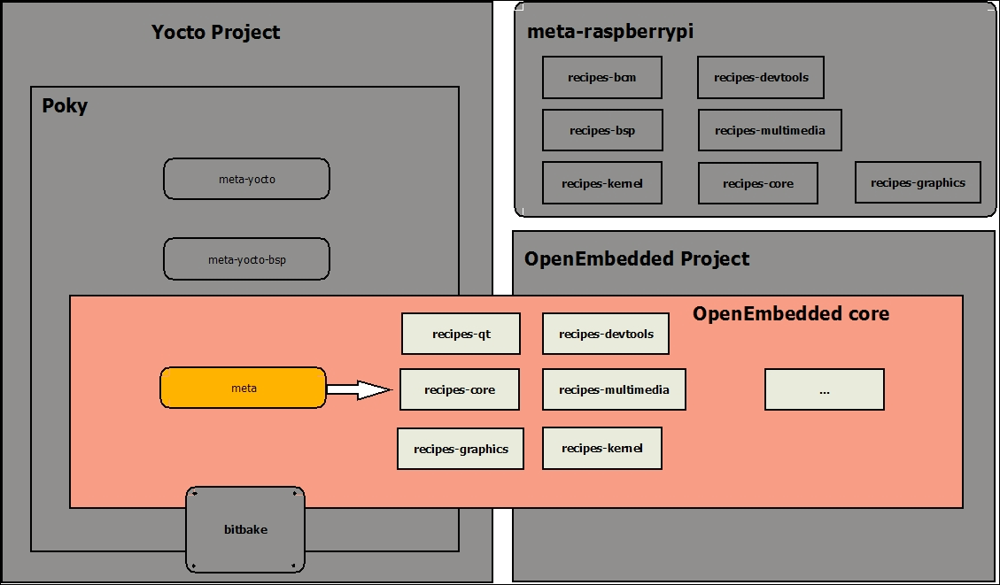

# This is yocto study practice

## Ecosystem
- BitBake
- OpenEmbedded
- Yocto project - poky

## Bitbake proces

## BB File structure
- ./conf
- ./sources
  - ./sources/meta-bsp - 
  - ./sources/poky
  - ./sources/meta-openembedded
  - ./sources/meta-* 
- ./build